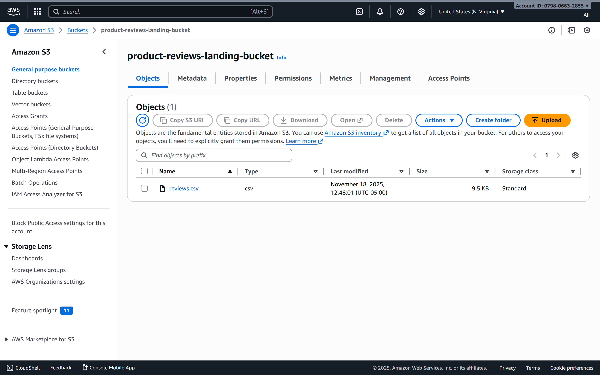

# Serverless Spark ETL Pipeline on AWS

This project implements an event-driven, serverless data pipeline on AWS that processes product review data using Apache Spark on AWS Glue.

When a new `reviews.csv` file is uploaded to Amazon S3, the pipeline automatically cleans the data and generates multiple analytics reports without any manual intervention.

---

## Project Overview

Goal: Automate the end-to-end data processing workflow for product reviews.

1. A raw `reviews.csv` file is uploaded to an S3 landing bucket.
2. An AWS Lambda function is triggered by the S3 upload event.
3. The Lambda function starts an AWS Glue ETL job.
4. The Glue job (PySpark script):
   - Reads the CSV file from S3.
   - Cleans and transforms the data.
   - Runs several Spark SQL analytics queries:
     - Average rating per product.
     - Date-wise review counts.
     - Top 5 most active customers.
     - Overall rating distribution.
5. The cleaned dataset and analytics outputs are written back to a separate processed S3 bucket.

---

## Architecture

Data flow:

`S3 (landing) -> Lambda (trigger) -> AWS Glue (Spark ETL) -> S3 (processed)`

- Landing bucket (raw data):  
  `product-reviews-landing-bucket`

- Processed bucket (clean + analytics):  
  `product-reviews-processed-bucket`

- Glue ETL script:  
  Reads from the landing bucket, writes:
  - Cleaned data to:  
    `s3://product-reviews-processed-bucket/processed-data/`
  - Analytics outputs to:  
    `s3://product-reviews-processed-bucket/Athena Results/`

---

## Technology Stack

- Storage / Data Lake: Amazon S3  
- ETL Engine: AWS Glue (Spark / PySpark)  
- Orchestration / Trigger: AWS Lambda + S3 event  
- Language: Python (PySpark + boto3)  
- Security / Access Control: AWS IAM roles and policies  

---

## Setup and Deployment

### 1. S3 Buckets

Create two S3 buckets (names must be globally unique):

- Landing bucket (raw files):  
  `product-reviews-landing-bucket`

- Processed bucket (cleaned + analytics):  
  `product-reviews-processed-bucket`

Both buckets are created in the same region.

---

### 2. IAM Role for AWS Glue

Create a role for AWS Glue with permissions to read from the landing bucket and write to the processed bucket.

- Service: Glue  
- Policies attached (for demo purposes):
  - `AWSGlueServiceRole`
  - `AmazonS3FullAccess` (could be replaced with a more restrictive, bucket-scoped policy)

Role name used in this project:  
`AWSGlueServiceRole-Reviews`

---

### 3. AWS Glue ETL Job

A Spark job named `process_reviews_job` is created in AWS Glue using the script:

`Glue ETL Script.py`

Key configurations inside the script:

```python
s3_input_path = "s3://product-reviews-landing-bucket/"
s3_processed_path = "s3://product-reviews-processed-bucket/processed-data/"
s3_analytics_path = "s3://product-reviews-processed-bucket/Athena Results/"
```

Main transformations:

- Cast `rating` to integer and fill nulls with `0`.
- Parse `review_date` as a proper date (`yyyy-MM-dd`).
- Fill null `review_text` with `"No review text"`.
- Create `product_id_upper` as uppercased `product_id`.

The cleaned DataFrame is written to:

- `s3://product-reviews-processed-bucket/processed-data/`

---

### 4. Lambda Function

Lambda function name: `start_glue_job_trigger`

Runtime: Python 3.x

Code:

```python
import boto3

GLUE_JOB_NAME = "process_reviews_job"

def lambda_handler(event, context):
    """
    This Lambda function is triggered by an S3 event and starts a Glue ETL job.
    """
    glue_client = boto3.client('glue')

    try:
        print(f"Starting AWS Glue job: {GLUE_JOB_NAME}")
        response = glue_client.start_job_run(JobName=GLUE_JOB_NAME)
        print(f"Successfully started job run. Run ID: {response['JobRunId']}")
        return {
            'statusCode': 200,
            'body': f"Glue job {GLUE_JOB_NAME} started successfully."
        }
    except Exception as e:
        print(f"Error starting Glue job: {e}")
        raise e
```

#### Lambda Permissions

The Lambda execution role has an inline policy that allows it to start Glue jobs:

```json
{
  "Version": "2012-10-17",
  "Statement": [
    {
      "Effect": "Allow",
      "Action": "glue:StartJobRun",
      "Resource": "*"
    }
  ]
}
```

---

### 5. S3 Trigger for Lambda

An S3 event notification is configured so that any new object created in:

`product-reviews-landing-bucket`

triggers the `start_glue_job_trigger` Lambda function.

- Event type: `s3:ObjectCreated:*`
- Prefix / Suffix: none (all uploads trigger the function)

This makes the pipeline fully event-driven.

---

## Spark SQL Analytics Queries

After cleaning and transforming the data, the Glue ETL script registers the DataFrame as a temporary view:

```python
df_transformed.createOrReplaceTempView("product_reviews")
```

Then it runs four analytics queries.

### 1. Average Rating per Product

```sql
SELECT 
    product_id_upper, 
    AVG(rating) AS average_rating,
    COUNT(*) AS review_count
FROM product_reviews
GROUP BY product_id_upper
ORDER BY average_rating DESC;
```

Output path:

- `s3://product-reviews-processed-bucket/Athena Results/`

---

### 2. Date Wise Review Count

Counts how many reviews are submitted per day:

```sql
SELECT 
    review_date,
    COUNT(*) AS review_count
FROM product_reviews
GROUP BY review_date
ORDER BY review_date;
```

Output path:

- `s3://product-reviews-processed-bucket/Athena Results/daily_review_counts/`

---

### 3. Top 5 Most Active Customers

Identifies customers who wrote the most reviews:

```sql
SELECT 
    customer_id,
    COUNT(*) AS review_count
FROM product_reviews
GROUP BY customer_id
ORDER BY review_count DESC
LIMIT 5;
```

Output path:

- `s3://product-reviews-processed-bucket/Athena Results/top_5_customers/`

---

### 4. Overall Rating Distribution

Shows how many reviews each rating value (1 to 5) received:

```sql
SELECT 
    rating,
    COUNT(*) AS rating_count
FROM product_reviews
GROUP BY rating
ORDER BY rating;
```

Output path:

- `s3://product-reviews-processed-bucket/Athena Results/rating_distribution/`

---

## Sample Analytics Results

Below are the actual results produced by the Glue job and written to the `Athena Results` subfolders.

### Daily Review Counts

Source: `Athena Results/daily_review_counts/`

```text
review_date,review_count
,1
2025-09-01,2
2025-09-02,2
2025-09-09,2
2025-09-10,2
2025-09-11,3
2025-09-12,2
2025-10-02,3
2025-10-03,2
2025-09-22,2
2025-09-23,2
2025-10-19,2
2025-10-20,3
2025-11-05,4
2025-11-06,3
2025-10-30,2
2025-10-31,3
2025-09-07,2
2025-09-08,3
2025-09-17,3
2025-09-18,2
2025-10-11,3
2025-10-12,2
2025-10-28,2
2025-10-29,3
2025-09-03,3
2025-09-04,2
2025-09-19,3
2025-09-20,2
2025-09-21,3
2025-11-01,4
2025-11-02,3
2025-11-09,4
2025-11-10,3
2025-09-24,2
2025-09-25,3
2025-09-30,2
2025-10-01,3
2025-10-04,3
2025-10-05,2
2025-11-07,4
2025-11-08,3
2025-09-05,3
2025-09-06,2
2025-09-15,3
2025-09-16,2
2025-10-17,3
2025-10-18,3
2025-09-26,2
2025-09-27,2
2025-10-23,3
2025-10-24,3
2025-10-25,2
2025-10-26,2
2025-10-27,3
2025-11-03,3
2025-11-04,4
2025-10-21,2
2025-10-22,3
2025-10-06,3
2025-10-07,3
2025-10-08,3
2025-10-09,3
2025-10-10,2
2025-09-13,3
2025-09-14,2
2025-10-13,3
2025-10-14,2
2025-09-28,2
2025-09-29,3
2025-10-15,2
2025-10-16,3
2025-11-11,2
2025-11-12,3
2025-11-13,4
2025-11-14,4
```

Note: there is one row with an empty `review_date`, which corresponds to records where the date could not be parsed or was null after casting.

---

### Rating Distribution

Source: `Athena Results/rating_distribution/`

```text
rating,rating_count
0,10
1,30
2,19
3,29
4,49
5,64
```

Interpretation:

- Ten reviews had a rating of 0 after cleaning (these came from missing ratings).
- Most reviews are positive (ratings 4 and 5 dominate).

---

### Top 5 Most Active Customers

Source: `Athena Results/top_5_customers/`

```text
customer_id,review_count
c-162,2
c-225,2
c-237,2
c-151,2
c-187,2
```

These are the customers who submitted the most reviews in the dataset. In this sample data, the top activity level is two reviews each.

---

## How to Run the Pipeline

1. Prepare the `reviews.csv` file (ensure it has no stray lines such as `auto_comment` in the middle).  
2. Upload `reviews.csv` to:

   `product-reviews-landing-bucket`

3. The S3 upload event triggers the Lambda function.  
4. Lambda calls the Glue job: `process_reviews_job`.  
5. The Glue job:
   - Reads the CSV from the landing bucket.
   - Cleans the data.
   - Runs the four Spark SQL queries.
   - Writes:
     - Clean data to `processed-data/`
     - Analytics to `Athena Results/` subfolders.

You can monitor the Glue job status in the AWS Glue console under Jobs -> Runs.

---

## Screenshots (Results and Verification)

1. S3 Landing Bucket Upload  
   - Screenshot of `product-reviews-landing-bucket` showing `reviews.csv`.

2. Glue Job Run Success  
   - Screenshot of `process_reviews_job` showing a successful run in the Glue console.

3. Processed Bucket Structure  
   - Screenshot of `product-reviews-processed-bucket` showing:
     - `processed-data/`
     - `Athena Results/`
     - `daily_review_counts/`
     - `top_5_customers/`
     - `rating_distribution/`




---

## Repository Structure

```text
.
├── Glue ETL Script.py
├── lambda function.py
├── reviews.csv
├── README.md
└── screenshots/
    ├── landing-bucket.png
    ├── glue-job-success.png
    ├── processed-bucket.png
    └── analytics-output.png
```
